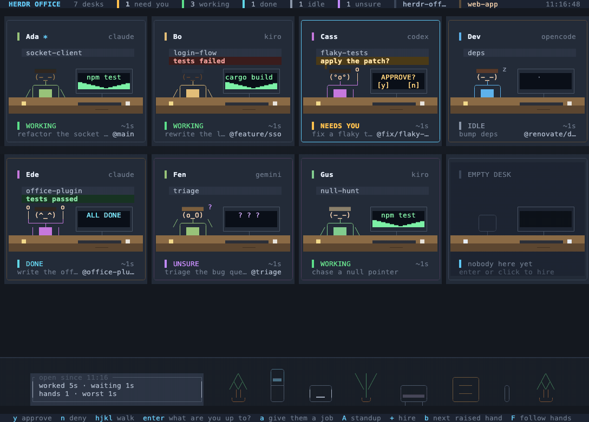

# Herdr Office

[](https://github.com/michaellandi/herdr-office/actions/workflows/check.yml)
[](https://herdr.dev)
[](https://nodejs.org)
[](LICENSE)

A [Herdr](https://herdr.dev) plugin that draws your agents as people in an open-plan
office. Every agent is a person at a desk. They type while they work, doze when they
are idle, and **raise a hand** when they are blocked on an approval. Click a desk (or
hit enter) to ask what they are up to.



The card pinned to each cubicle wall is the **tab name**, so you can see who is on
which job without opening anything. When someone gets stuck, a **speech bubble**
appears over their head with the actual thing they are waiting on, and `y` / `n`
answers it from right here without walking over to their pane.

## Install

```sh
herdr plugin install michaellandi/herdr-office
```

Or clone it and link it instead, which is the one you want if you plan to change the
art:

```sh
git clone https://github.com/michaellandi/herdr-office.git && cd herdr-office
herdr plugin link .
```

No dependencies and no build step: it is plain Node (18+) talking to the Herdr socket API.

## Use

| How | What |
|---|---|
| `herdr plugin action invoke office.view.open` | Open the office as a zoomed pane |
| `herdr plugin action invoke office.view.peek` | Open it as a session-modal popup |
| `herdr plugin pane open --plugin office.view --entrypoint office --placement tab` | Pick your own placement |
| `node office.mjs` | Run it standalone in any terminal that can reach the socket |
| `node office.mjs --demo` | Fake roster, no server needed (good for hacking on the art) |
| `node office.mjs --once` | Render a single frame to stdout and exit |
| `node office.mjs --quiet` | Same, without the toast when somebody starts waiting on you |

Bind it to a key in `~/.config/herdr/config.toml`:

```toml
[[keys.command]]
key = "prefix+o"
type = "plugin_action"
command = "office.view.open"
description = "open the office"
```

You get a Herdr toast when somebody starts waiting on you. Run it with `--quiet` if you
would rather not.

## Keys

| Key | Action |
|---|---|
| arrows / `hjkl` | walk around the floor (walking off the edge pages to the next floor) |
| `enter` / click | ask that person what they are up to |
| drag a desk onto another | swap the two real panes |
| `y` / click `[y]` | approve what they are stuck on |
| `n` / click `[n]` | deny it |
| `b` | jump to the next raised hand |
| `f` | focus that agent's real pane |
| `r` | refresh now |
| `esc` | close the panel |
| `q` | leave |

`y` and `n` work from the floor and from an open desk, on whoever is selected. They
only do anything if that person is actually waiting on you.

The `[y]` and `[n]` drawn on a stuck person's monitor are real buttons: click either
one to answer that desk without selecting it first or opening anything. The same
choices in the detail panel's **answer them** row are clickable too.

## Moving people around

Desks are laid out in the order the panes really are: workspace, then tab, then
top to bottom and left to right within the tab. So the floor is a picture of your
session rather than an arbitrary list, and **dragging one desk onto another swaps
the two panes for real**. The desk you picked up goes pale, the one you are about
to drop it on lights up, and `esc` or a drop on empty carpet puts it back.

A press only selects. Opening a desk waits for the release, because a press that
turned into a drag was never a request to open anything, and the `[y]` and `[n]`
buttons answer on press and cannot be dragged at all: an approval is the one
irreversible thing on this screen, so it is not also a handle you can pick
somebody's desk up by. Dropping a desk *on* a colleague's `[y]` swaps the two
desks and does not answer for them.

Swapping panes is reversible and closes nothing, so it does not ask first. It
does keep both desks pale until the server confirms, so a swap in flight never
looks like a room that has finished moving.

## Answering from the office

Agents do not agree on what an approval prompt looks like, so the keys are read off
the agent's own screen rather than guessed: a literal `(y/n)` prompt gets a letter, a
numbered menu gets `1` (the plain yes, never the "and stop asking me" variant), and
anything unrecognised falls back to enter and esc. The panel spells out what it is
about to send, so a bad read is something you can see before you press the key rather
than after.

Opening a desk splits the room instead of taking it over: the panel takes the bottom
half and the floor keeps the top, so you can read one agent while watching the rest.
Arrow keys still walk the floor with the panel open, and it follows you.

## Who is who

| State | Desk |
|---|---|
| `working` | hands on the keyboard, screen scrolling, green |
| `blocked` | hand up and waving, `APPROVE?` on screen, a speech bubble with the ask, pulsing amber |
| `idle` | dozing (`z`), slate |
| `done` | arms up, `ALL DONE`, cyan |
| `unknown` | shrugging, violet. Herdr sees an agent it cannot classify, which is *not* proof of completion |

Desks are named by seat from a pool of forty, so the front row is always Ada,
Bo, Cass, Dev and Ede. Faces, hair and shirt colours come from the pane id instead, so
a desk keeps its look between runs even if a new pane appearing earlier on the floor
shifts the names along. `*` marks the focused pane.
Durations prefixed with `~` are a lower bound: the API reports current state, not when
it was entered, so the first sighting of an agent starts the clock.

## How it works

- `agent.list` + `session.snapshot` + `tab.list` build the roster; a 2s poll is the
  floor, and subscriptions make it feel instant. The snapshot's `layouts` are where
  the seating comes from: `panes[].rect` is the real geometry, so the desks are in
  the same order as the panes and a swap is visible instead of being a change you
  have to take on faith.
- Dragging is one `pane.swap` with an explicit source and target. Mouse mode is
  `1002` rather than `1000`, because press-and-release alone cannot tell you where
  a desk went on the way.
- Subscriptions: the global pane/workspace/tab events, plus one
  `pane.agent_status_changed` descriptor per pane (that event is per-pane only, so the
  subscription is rebuilt whenever the set of desks changes).
- Speech bubbles cost one `agent.read --source visible` per *stuck* desk, refreshed at
  most every 6s. Nobody else is read until you open their desk, so a quiet office is
  three calls every two seconds no matter how many agents you are running.
- Opening a desk reads `agent.read --source visible`: the current screen, which is
  exactly "what are you up to". For idle and done agents it also tries
  `recent_unwrapped` for more history.
- `agent.explain` supplies the detection reasoning, shelled out through the CLI.
- Answering is one `agent.send_keys`, then a refresh 400ms later because herdr has not
  noticed the prompt is gone yet and the hand would otherwise stay up.
- Whatever room is left under the desks becomes the back wall of the office, and the
  plants, water cooler, printer, whiteboard, sofa and filing cabinets stand against it.
  The layout is deterministic (the same office every time, not a new one every 320ms)
  and it only ever lands on floor the desks are not using, so scenery can never cover a
  raised hand. On a pane too short to leave any room, the furniture is simply not there.

## Hacking on it

```sh
node --test test/*.test.mjs      # the whole suite, no dependencies to install
node office.mjs --demo           # the office, with a fake roster and no server
node office.mjs --once --demo    # one frame to stdout, for diffing the art
./scripts/record-demo.sh         # re-record the README's GIF (needs vhs + ffmpeg)
```

The art is drawn on a fixed cell grid, and the invariant the whole renderer rests on
is that **every line is exactly as many cells wide as the pane and every frame is
exactly as many lines tall**. Frames are written straight to the terminal without
being measured, so one line a single cell too wide wraps and shoves every row below
it down by one, and the screen stays broken until something forces a full redraw.
`test/grid.test.mjs` asserts that invariant over every pane size from 200x60 down to
20x8, every animation frame, and every state the detail panel can be in. It is the
suite that matters most: when it fails, it has usually found a real corruption bug
rather than a changed expectation.

Two rules that are easy to break by accident:

- **Only unambiguous-width glyphs in the art.** Latin-1, box drawing (U+2500 to
  U+257F) and block elements (U+2580 to U+259F). Geometric Shapes start at U+25A0 and
  are off limits, because `▪` is one cell in some terminals and two in others, which
  is unfixable once it is on the grid. `test/sprites.test.mjs` enforces this.
- **`y` and `n` send real keystrokes to real agents.** Never test approve or deny
  against a live office; `--demo` prints what it would have sent instead.
  `test/summary.test.mjs` covers the prompt reading, including the one case that
  matters most: the "yes, and don't ask again" menu option must never be the one
  picked automatically.

CI runs the suite plus a couple of live `--once` renders on macOS and Linux across
Node 18, 20 and 22. The Herdr marketplace indexes whatever is on the default branch
rather than a release tag, so `main` is what strangers install and it has to stay
green.

## Known rough edges

- **Reads that page scrollback can drop the connection.** On herdr 0.9.0, an
  `agent.read` with a `recent` source against a busy full-screen agent can make the
  server hang up mid-response instead of returning `agent_not_idle`. The office
  defaults to the `visible` source and reconnects itself, so a bad desk costs you one
  socket, not the room.
- **`agent.explain` over the socket does the same thing**, so that call goes through
  the `herdr` CLI (`HERDR_BIN_PATH`) instead of the socket.
- **Three in-flight requests on one socket is one too many.** On herdr 0.9.0 the
  server answers two concurrent requests and hangs up on the third, so a
  `Promise.all` of three quietly loses the last one. The client queues requests
  instead: callers fire whatever they like, the wire stays single file.
- **Emoji and other ambiguous-width glyphs are stripped** from pane titles and screen
  text before drawing, because they wreck a fixed cell grid.
- **`y` sends a real keystroke to a real agent.** The prompt shape is inferred, so on
  an agent whose approval UI nobody has taught it about, `y` falls back to enter. Check
  what the panel says it will send before trusting it on a new agent.
- **The "stuck on" line is a heuristic** over the visible screen: keybinding hints are
  filtered out and real questions preferred, but a novel prompt shape can still fool
  it. The full screen is right there underneath it.
- macOS and Linux only. Windows would work in principle (the socket helper falls back
  to the CLI path Herdr recommends) but is untested.

## License

MIT. See [LICENSE](LICENSE).
