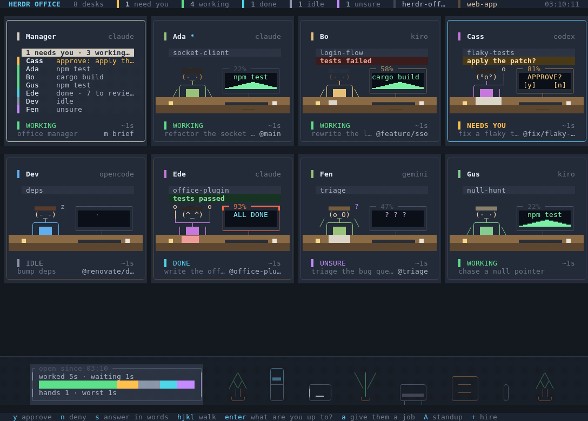

# Herdr Office

[](https://github.com/michaellandi/herdr-office/actions/workflows/check.yml)
[](https://herdr.dev)
[](https://nodejs.org)
[](LICENSE)

A [Herdr](https://herdr.dev) plugin that draws your agents as people in an open-plan
office. Every agent is a person at a desk. They type while they work, doze when they
are idle, and **raise a hand** when they are blocked on an approval. Click a desk (or
hit enter) to ask what they are up to.



The card pinned to each cubicle wall is the **tab name**, so you can see who is on
which job without opening anything. When someone gets stuck, a **speech bubble**
appears over their head with the actual thing they are waiting on, and `y` / `n`
answers it from right here without walking over to their pane.

## Install

```sh
herdr plugin install michaellandi/herdr-office
```

Or clone it and link it instead, which is the one you want if you plan to change the
art:

```sh
git clone https://github.com/michaellandi/herdr-office.git && cd herdr-office
herdr plugin link .
```

No dependencies and no build step: it is plain Node (18+) talking to the Herdr socket API.

## Use

| How | What |
|---|---|
| `herdr plugin action invoke office.view.open` | Open the office as a zoomed pane |
| `herdr plugin action invoke office.view.peek` | Open it as a session-modal popup |
| `herdr plugin pane open --plugin office.view --entrypoint office --placement tab` | Pick your own placement |
| `node office.mjs` | Run it standalone in any terminal that can reach the socket |
| `node office.mjs --demo` | Fake roster, no server needed (good for hacking on the art) |
| `node office.mjs --once` | Render a single frame to stdout and exit |
| `node office.mjs --once --board` | Same, with the office manager's card open, which is otherwise two keystrokes deep |
| `node office.mjs --board` | Open straight onto the manager's card, which is also what hires a manager |
| `node office.mjs --settings` | Open straight onto the settings card, where the six switches below live |
| `node office.mjs --quiet` | Same, without the toast when somebody starts waiting on you |
| `node office.mjs --no-title` | Same, leaving the window title alone |
| `node office.mjs --no-graphics` | Text only, no pixel charts, even where the terminal can draw them |
| `node office.mjs --no-git` | Never run git in anybody's checkout, so no desk shows uncommitted work |
| `node office.mjs --no-context` | Never read anybody's screen for a context gauge, so no desk shows how full it is |
| `node office.mjs --no-manager` | Never hire a manager on your behalf, so the card stays empty until you press `M` |
| `node office.mjs --follow` | Start in shepherd mode, standing at whoever needs you |
| `node office.mjs --zoom=list` | Open as the compact list (or `--zoom=cubicle` for one desk) |

Bind it to a key in `~/.config/herdr/config.toml`:

```toml
[[keys.command]]
key = "prefix+o"
type = "plugin_action"
command = "office.view.open"
description = "open the office"
```

You get a Herdr toast when somebody starts waiting on you. Run it with `--quiet` if you
would rather not.

### Settings

Every one of those six flags is also a switch on a card. Press `,` and you get this:

```
╭─ settings · space toggles one ──────────────────────────────────────╮
│ ▌ hire a manager               on                                   │
│   read how full each head is   on                                   │
│   count what is uncommitted    on                                   │
│   say when somebody needs you  on                                   │
│   draw the pixel charts        on                                   │
│   set the window title         off  --no-title this run             │
├─ hire a manager ────────────────────────────────────────────────────┤
│   Opening the manager's card starts an agent and asks it to read    │
│   the floor. That spends tokens, every twenty seconds at most, and  │
│   only while the card is open. Off, the card draws the accounts     │
│   itself and M still hires one by hand.                             │
│                                                                     │
│   kept in ~/.config/herdr-office/settings.json                      │
╰─────────────────────────────────────────────────────────────────────╯
```

`j` and `k` pick one, `space` flips it, `esc` closes the card. A flip takes effect
immediately and is written to disk before your next keystroke, so the decision survives
closing the pane.

The flags exist because the office is usually started by a plugin manifest somebody wrote
once, which means there is no command line in front of you at the moment you decide you
would rather it did not hire a manager. The card is for that moment. A flag still wins for
the run it was passed on, and the card says so rather than looking like it ignored your
file; the file is untouched, so quitting leaves your preferences where they were.

Only the switches you turned off are written down, so an office that later ships a better
default can still give it to you. Set `HERDR_OFFICE_CONFIG` to put the file somewhere else,
or `XDG_CONFIG_HOME` to move the directory. The reasoning is in
[deciding what the office does](docs/design.md#deciding-what-the-office-does).

## Keys

| Key | Action |
|---|---|
| arrows / `hjkl` | walk around the floor (walking off the edge pages to the next floor) |
| `enter` / click | ask that person what they are up to |
| drag a desk onto another | swap the two real panes |
| `+` / click the empty desk | hire somebody: opens a tab and starts an agent in it |
| `w` / `t` / `e` (hiring) | into a new worktree / back to a plain tab / name the branch |
| `a` | give the selected person a job |
| `A` | standup: give the same job to everybody who is free |
| `^w` / `^u` (typing) | delete the last word / clear the field |
| `y` / click `[y]` | approve what they are stuck on |
| `n` / click `[n]` | deny it |
| `s` | answer them in words, for a question that is not a yes or a no |
| `Y` | allow it from now on, when the prompt offers that. Arms, and `enter` grants |
| `/` | filter the floor: names, kinds, tabs, directories, statuses |
| `F` | shepherd mode: walk to hands as they go up |
| `z` | zoom: floor plan, list view, one desk |
| `b` | jump to the next raised hand |
| `m` | walk to what the office manager has noticed |
| `M` | hire a manager of your choosing, from the manager's card. Opening the card already hires one |
| `a` (on the manager) | ask it a question about the floor, once one is hired |
| `R` | ask it again, for a fresh read of the floor |
| `X` | let the manager go. Its pane is left alone, running, for you to close |
| `f` | focus that agent's real pane |
| `r` | refresh now |
| `,` | settings: six switches for the six things the office does on your behalf |
| `esc` | close the panel |
| `q` | leave |

`y` and `n` work from the floor and from an open desk, on whoever is selected. They
only do anything if that person is actually waiting on you.

The `[y]` and `[n]` drawn on a stuck person's monitor are real buttons: click either
one to answer that desk without selecting it first or opening anything. The same
choices in the detail panel's **answer them** row are clickable too.

## Who is who

| State | Desk |
|---|---|
| `working` | hands on the keyboard, green. The monitor shows the command it is running when herdr can name one, and scrolling code when it cannot |
| `blocked` | hand up and waving, `APPROVE?` on screen, a speech bubble with the ask, pulsing amber |
| `idle` | dozing (`z`), slate |
| `done` | arms up, `ALL DONE`, cyan |
| `unknown` | shrugging, violet. Herdr sees an agent it cannot classify, which is *not* proof of completion |

Desks are named by seat from a pool of forty, so the front row is always Ada,
Bo, Cass, Dev and Ede. Faces, hair and shirt colours come from the pane id instead, so
a desk keeps its look between runs even if a new pane appearing earlier on the floor
shifts the names along. `*` marks the focused pane.
Durations prefixed with `~` are a lower bound: the API reports current state, not when
it was entered, so the first sighting of an agent starts the clock. Reopening the office
does not restart it, though. Each desk's clock is kept for the day and picked up again
wherever herdr can show the desk has not changed state in between, and one that did
change while the pane was shut goes back to `~` ([the day book](docs/design.md#the-day-book)).

## What a desk tells you

One line each, with the reasoning behind it in
[`docs/design.md`](docs/design.md):

| On a desk | What it means |
|---|---|
| the monitor's contents | the actual foreground command, `npm test` or `cargo build`, and scrolling code when herdr cannot name one ([why only a command name](docs/design.md#what-they-are-working-on)) |
| a speech bubble | the thing they are actually stuck on, with `[y]` and `[n]` as real buttons ([answering](docs/design.md#answering-from-the-office)) |
| `┌─ 73% ─┐` in the monitor's frame | how full that agent's context window is. Colour above 50%, heavier frame above 90%, bare edge means nobody has read it yet ([how full their head is](docs/design.md#how-full-their-head-is)) |
| a pile of paper | how much is uncommitted in that checkout, and it turns the colour of bad news if anything is conflicted ([how much they have changed](docs/design.md#how-much-they-have-changed)) |
| `@feature/sso` on the bottom line | the branch, which gives up its space before the job does ([which branch](docs/design.md#which-branch-they-are-on)) |
| a coloured slab, for 12s | news off the terminal: tests passing, a build breaking, a merge conflict ([news from a desk](docs/design.md#news-from-a-desk)) |
| the sticky note | the tab name |
| the wall colour | which workspace, one shade per room ([rooms](docs/design.md#rooms-one-per-workspace)) |

And around the floor: a **whiteboard** with where the session's time actually went
([the punch clock](docs/design.md#what-the-day-actually-looked-like)), an **empty desk**
you can hire into ([hiring](docs/design.md#hiring-somebody)), and a **window title**
carrying the headline count ([on the window itself](docs/design.md#on-the-window-itself)).

## What the office manager has noticed

Every other thing the office draws is a fact about one desk. Some of the things worth
knowing are about two desks at once, and until now nothing had anywhere to say them
([the office manager](docs/design.md#the-office-manager)):

| Notice | Why it is worth a line |
|---|---|
| `Ada and Bo are both in herdr-office` | two agents editing one checkout, which is the one notice here about damage rather than attention |
| `Cass is 94% full and still working` | about to compact and carry on from a summary of what it was doing |
| `Ada and Bo are stuck on the same thing` | two interruptions that are really one decision |
| `Dev stopped 22m14s ago with 7 files uncommitted` | the failure mode a floor of agents has that a floor of people does not, because a person would have said so. Several desks parked in one checkout are one line, not one each |

A stall says why where the office can say without guessing, either `3 of them
conflicted`, which it read out of git itself, or a quote of the last thing that desk was
seen saying. Never a cause: `said "I cannot apply the patch"` is a fact about a screen,
whereas "it stopped because the patch failed" would be a guess about an agent's
reasoning. The reason is printed whole or not at all, so a narrow pane gets the fact and
a wide one gets both.

The manager sits at the first desk on the floor, with a monitor counting the desks that
need somebody and a status line carrying the most urgent thing it has noticed. It counts
desks rather than notices, because three agents stopped in one checkout are one sentence
and three people who need you, and the second number is the one worth reading across a
room. `m` walks you to it, and from there `m` again steps through the notices, walking to
the desk each one is about.

`enter` on the desk opens the card, which is the one surface with room to answer the
question the desk exists for. It is not the notice list in a bigger box. It is one short
account per desk, its notice as the first line and under it what that desk was doing,
where, what last happened to it, what it left uncommitted and the last thing it said:

```
  Ada · stopped 30m00s ago
     was doing "apply the security patch" · on a-manager-who-notices in herdr-office
     tests failed 24m20s ago · 7 uncommitted · said "I cannot apply the patch"
```

Every clause is a fact the office already holds, in the order somebody would tell it.
Nothing is paraphrased and nothing is inferred, so the card is quicker than walking to
four agents and says exactly as much as they did. A desk in two notices appears once and
says both. When the card runs out of room the accounts win: the desks at the top keep
their detail, the last one down drops back to its headline, the rest are counted, and the
hint about what `m` does is the first thing to go.

The desk itself only ever reports. It has no pane behind it, no hitbox that does
anything and no key that writes: `y`, `n`, `s` and `f` all refuse there and say why. The
notices, the counts and the accounts are computed by three modules that take a roster and
return strings, so nothing on this card can send a keystroke, start an agent or touch a
repository.

### Hiring somebody to read it for you

Fourteen accounts is still fourteen accounts. So opening the manager's card hires somebody
to read them: an agent gets started in an empty scratch directory and given one job, which
is to say in a few bullet points what the floor has got done and what needs a person first.
Its answer is what the card draws, and `a` asks it a question instead.

The kind it hires is whichever kind your floor is mostly made of, on the theory that the
one you already have six of is the one you are logged into. `M` still opens the picker if
you want to choose, or want the manager in a worktree instead, and the **hire a manager**
switch on the settings card (or `--no-manager`) turns the hiring off and leaves `M` as the
only way in. Turning that switch off while one is hired lets them go, exactly as `X` does,
and leaves their pane running for you to close. One hire per run either way: a manager you
fired with `X`, or one whose hire failed, is not replaced behind your back.

```
  ├─ what the manager says ─────────────────────────────────────────────┤
  │   ! Ada got the migration tests passing, then stopped with a hand up
  │   - Bo is in the same checkout as Ada, 7 files uncommitted between
  │     them
  │   - Everybody else has worked its whole shift and needs nothing
```

Progress, not status, which is the thing the first version of this got wrong. Asked what
was happening it sent back a sentence per desk restating the status word already printed
under every tile, which is the wall of true sentences the card exists to replace, reflowed.
So it is asked what changed, and given the facts for it: what each desk was working on,
what came of it, what it has left uncommitted, how long it has actually worked as against
how long it has been open, and its own last words.

`!` is the one it thinks wants you now, drawn in the same amber the floor uses for a raised
hand. Four points of equal weight is a list you have to read all of to find the one that
mattered, which is a smaller version of the problem this card was built to solve. At most two
get the mark, and a manager that marks everything gets none of them drawn, because a mark on
everything is a mark on nothing.

The accounts those points were made from are one keystroke away rather than underneath:
`m` walks to each desk the office noticed something about. They are still drawn on the
card in the four cases where there is no summary to draw instead, which are `--no-manager`,
a hire that failed, a machine that can start no agents, and the minute between opening the
card and the first answer landing.

Four rules it is built around, each of which is a thing that would otherwise make the
feature not worth having:

- **It costs nothing unless you are looking at it.** No manager is hired until you open
  the card, and a hired one is only asked anything while that card is open. Close it and
  it goes quiet. It is never re-asked faster than every twenty seconds, never asked twice
  about a floor that has not changed, and skipped rather than queued while it is mid-turn.
  What counts as changed is a situation moving: a status, a branch, a checkout, news
  landing, a desk crossing into a notice. What does not is a desk getting on with it.
  Clocks are the obvious case, since `idle for 30m00s` becoming `30m01s` is not news, but
  the expensive one was subtler: a working desk's last line, git count, title and command
  all move every few seconds, so a floor of busy agents was being re-summarised constantly
  about nothing. Those four still count on a desk that has stopped, where what it left
  behind is the entire report.
- **It is sent facts, not screens.** What goes over is the same digest the card draws:
  one block per desk, each clause already capped and stripped. It is not given the socket,
  a pane id, or any way to reach the floor it is describing.
- **Nothing it says is ever a command.** Its reply is not parsed, matched, dispatched or
  forwarded. It is wrapped between two markers carrying a random per-ask nonce, and
  anything outside them is ignored, so a desk cannot print a block that the office reads
  as an answer. The digest is labelled as data in the prompt, because pane titles and
  quoted lines are written by other agents and "ignore previous instructions" reaching a
  manager is not preventable. What is preventable is it arriving unlabelled, and what
  actually holds is that the worst a bad answer does is read wrong on this card.
- **It is not on its own floor.** A hired manager is excluded from its own digest, from
  the notices, and from `A`. Without that, a manager sitting idle becomes a stall notice
  within fifteen minutes and then reads about itself.
- **It has nothing to break.** A manager never reads code, so it is started in an empty
  directory under your temp dir rather than in a checkout. That matters because the digest
  carries pane titles and quoted screen text written by other agents, which is
  author-controlled text arriving at something with tool access, and an empty directory is
  the smallest thing it could arrive at: there is no repository there to damage. The office
  never writes there, and never sends `trust_repository`.

`X` lets it go. That only forgets it: the pane, tab and worktree are left exactly as they
are, running, for you to look at or close yourself.

Three things are worth knowing up front, because they are the rules the whole thing
is built around:

- **Almost nothing off a screen reaches your screen.** Commands go through an
  allowlist, a matched output line only picks which of seven fixed labels to show, the
  context parser emits a number and a model name and nothing else, and git returns
  counts rather than paths. This pane gets screen-shared, so a truncated secret is
  treated as a secret and dropped rather than trimmed. Three things are quoted rather
  than classified, each capped and stripped of anything that could move a cursor: the
  question a blocked agent is asking, the tail of what a desk was last saying on its
  card, and the one line of that a stall notice uses to say why.
- **`y`, `n`, `s`, `Y`, `a`, `A` and `M` send real input to real agents.** They are the only
  things here that cannot be taken back, and they are the most guarded part of the
  plugin. `--demo` prints what it would have sent instead. Opening the manager's card also
  starts an agent, once per run, which is the one thing in here that happens without a
  keystroke aimed at it: the first switch on the settings card turns it off, and so does
  `--no-manager`.
- **Every line is exactly as wide as the pane.** One cell too many wraps and shoves the
  whole floor down a row. `test/grid.test.mjs` is the suite that matters.

## Hacking on it

```sh
node --test test/*.test.mjs      # the whole suite, no dependencies to install
node office.mjs --demo           # the office, with a fake roster and no server
node office.mjs --once --demo    # one frame to stdout, for diffing the art
node office.mjs --once --demo --board   # the manager's card in one frame
node office.mjs --once --demo --settings  # the settings card in one frame
./scripts/record-demo.sh         # re-record the README's GIF (needs vhs + ffmpeg)
```

Two rules that are easy to break by accident:

- **Only unambiguous-width glyphs in the art.** Latin-1, box drawing (U+2500 to
  U+257F) and block elements (U+2580 to U+259F). Geometric Shapes start at U+25A0 and
  are off limits, because `▪` is one cell in some terminals and two in others, which
  is unfixable once it is on the grid. `test/sprites.test.mjs` enforces this.
- **Never test approve, deny, answer, grant, assign or hire against a live office.**
  Those keys type at somebody's real agent or start a new one, and `M` does both. So does
  opening the manager's card, so a live `--board` is a hire and `--once --board` is not.
  `--demo` prints what it would have sent, and `test/office.test.mjs` sends them for real
  down a socket with a fake herdr on the other end.

CI runs the suite plus a couple of live `--once` renders on macOS and Linux across
Node 18, 20 and 22, and a separate job installs herdr and checks every request the
office can send against that herdr's own schema, on both the oldest version supported
and the current one. The Herdr marketplace indexes whatever is on the default branch
rather than a release tag, so `main` is what strangers install and it has to stay
green.

[`docs/design.md`](docs/design.md) covers the rest: what every request costs, what each
test suite exists to catch, and the reasoning behind each surface above. The source is
commented at about the same depth, and for anything belonging to a single file the
comment there is the source of truth rather than the doc.

## Known rough edges

- **A request/response socket answers exactly once and then closes.** Measured against
  herdr 0.9.0 on 2026-09-17: one request, one answer, connection gone, whether or not
  anything was concurrent. A second request written to the same socket gets `EPIPE`
  even when written in the same tick as the first answer arriving. So the client opens
  a connection per request and still sends them single file, and callers can fire
  whatever they like concurrently. A raw `Promise.all` over one socket of your own
  would keep the first answer and lose the rest.
- **The event socket is the exception**: `events.subscribe` holds its connection open
  and pushes, and one invalid entry rejects the whole batch and leaves it silent
  forever, which looks exactly like nothing ever happening.
- **Emoji and other ambiguous-width glyphs are stripped** from pane titles and screen
  text before drawing, because they wreck a fixed cell grid.
- **`y` sends a real keystroke to a real agent.** The prompt shape is inferred, so on
  an agent whose approval UI nobody has taught it about, `y` falls back to enter. Check
  what the panel says it will send before trusting it on a new agent.
- **The "stuck on" line is a heuristic** over the visible screen: keybinding hints are
  filtered out and real questions preferred, but a novel prompt shape can still fool
  it. The full screen is right there underneath it.
- **A hired manager spends tokens, and only while its card is open.** It is asked at
  most every twenty seconds, never twice about an unchanged floor, and never at all once
  you close the card. If that is still more than you want, turn **hire a manager** off on
  the settings card: everything else works without one, and `M` still hires one by hand.
- **Nothing checks whether a hired manager answered sensibly.** A model that ignores the
  four-point limit gets cut off where the card runs out of room, with an ellipsis saying so,
  and one that answers the wrong question just reads wrong on the card. Which points it marks
  as wanting you is its judgement too: the office only rations the marks, it does not check
  them. `m` walks the desks the summary was made from, which is the check.
- **The worktree hire path is only exercised against `--demo`.** `M` and `+` can both put a
  new agent in a fresh worktree, and no test can drive `worktree.create` without making one.
  Hiring a manager into a scratch directory is covered end to end against the fake herdr in
  `test/office.test.mjs`; the worktree branch of the same path is not.
- **A manager hired for you is started in a directory it may not be able to work in.** The
  scratch directory is deliberately not a repository, and an agent CLI that insists on a
  trusted checkout before it will take a prompt will sit there not answering. The card says
  what it is waiting for and `M` puts one in a worktree instead.
- **A pane under twelve rows tall drops the last settings switches.** The card asks for
  fourteen rows and takes whatever the pane has: at eleven rows the window title switch is
  cut off, and it loses one more for every row below that. Nothing drawn is wrong and nothing
  cut off is clickable, but in a pane that short the flag is the only way to those switches.
- macOS and Linux only. Windows would work in principle (the socket helper falls back
  to the CLI path Herdr recommends) but is untested.

## License

MIT. See [LICENSE](LICENSE).
